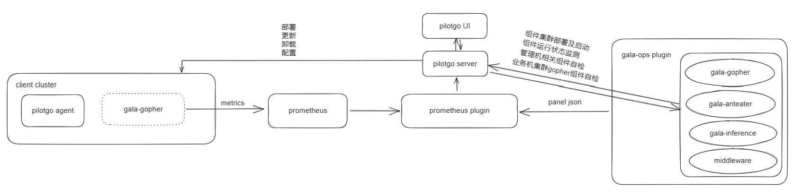

# PilotGo-plugin-gala-ops

#### 介绍
PilotGo gala-ops应用插件，提供aops开源项目gala-spider、gala-anteater、gala-inference、gala-gopher等基础组件以及kafka、arangodb、pyroscope、elasticsearch、logstash等中间件基于PilotGo平台的集群部署、状态检测、一键启动、数据可视化等功能。

note：PilotGo gala-ops插件运行依赖PilotGo主平台，如何在PilotGo平台中使用插件，请参考PilotGo平台文档。

#### 软件架构
1. 开发工具：golang 1.19
2. 系统支持：  
    业务机节点：openEuler-22.03-LTS-SP1  
    管理机节点：openEuler-22.03-LTS-SP1、kylin-v10-server

#### 安装及使用教程
1. 管理节点部署PilotGo gala-ops插件  
    git clone https://gitee.com/openeuler/PilotGo.git
2. 编辑配置文件  
    cd pilotgo-plugin-gala-ops/server  
    vim config.yml
3. 在pilotgo-plugin-gala-ops/server目录下运行插件  
    go run main.go
3. 在PilotGo平台导入PilotGo gala-ops插件应用
4. 在PilotGo平台使用PilotGo gala-ops插件相关功能 

#### 参与贡献

1.  Fork 本仓库
2.  新建 Feat_xxx 分支
3.  提交代码
4.  新建 Pull Request

